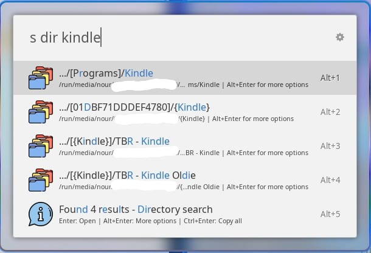
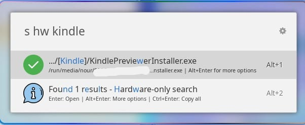
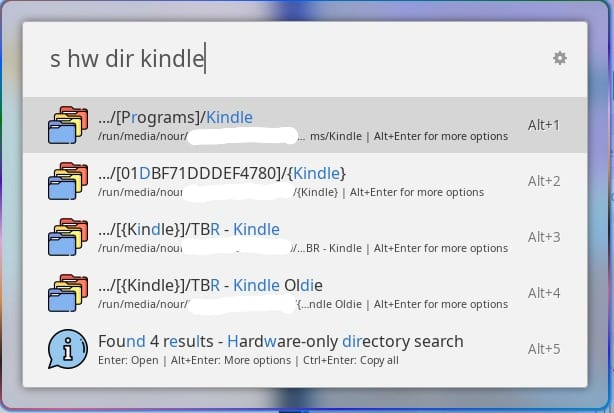

## Introducing FileFlow: Your Ultimate File Management Solution

In a digital world overflowing with files, documents, and data, staying organized is more challenging than ever. Welcome to the official launch of FileFlow, a powerful Ulauncher extension designed to bring order to the chaos and streamline your digital workflow by leveraging the speed of indexed search.

### What is FileFlow?

FileFlow is a smart, intuitive file search extension for Ulauncher that uses `plocate`/`locate` to find files almost instantly. It's built for speed and efficiency, and it's packed with features to help you find what you're looking for, wherever it is.

### Core Features

FileFlow is more than just a simple file search. Here are some of the features that make it an indispensable tool for any power user:

#### Blazing-Fast Indexed Search

At its core, FileFlow uses your system's file index to deliver search results in a fraction of a second. Just type `s` followed by your search term, and watch the results appear instantly.

#### Directory-Only Search

Need to find a folder? No problem. Use the `dir` keyword to filter your search and show only directories. This is perfect for quickly navigating your filesystem.

#### Hardware Drive Scanning

One of FileFlow's standout features is its ability to search mounted hardware drives. By using the `hw` keyword, you can extend your search to include external hard drives, USB sticks, and other removable media.

#### Advanced Hardware and Directory Search

Combine the `hw` and `dir` keywords to perform a highly specific search for directories located only on your mounted hardware. It's the ultimate tool for finding that one specific folder on that one specific drive.

#### More Than Just Searching

FileFlow also includes a number of other features to improve your workflow:
*   **"Open With..." Menu:** Don't want to use the default application? Press `Alt+Enter` on a result to bring up a menu of applications to open the file with.
*   **Open Folder Location:** Quickly jump to the folder containing a file from the `Alt+Enter` menu.
*   **Copy All Paths:** Need a list of all the files you found? A quick `Ctrl+Enter` will copy all the result paths to your clipboard.

### Get Started with FileFlow

Ready to take control of your digital life? Installing FileFlow is as simple as adding it to your Ulauncher extensions.

### Where to Get It

You can download Ulauncher from [its official website](https://ulauncher.io/). Once you have Ulauncher installed, you can add the FileFlow extension from its official page on the Ulauncher extensions website or directly from the GitHub repository.

*   [FileFlow on Ulauncher Extensions](https://ext.ulauncher.io/-/github-nourabosen-fileflow)
*   [FileFlow on GitHub](https://github.com/nourabosen/FileFlow)

Thank you for reading!
